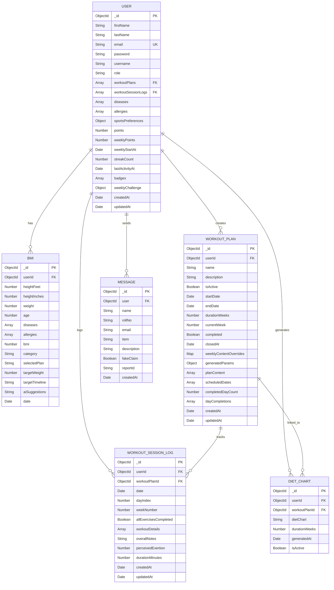
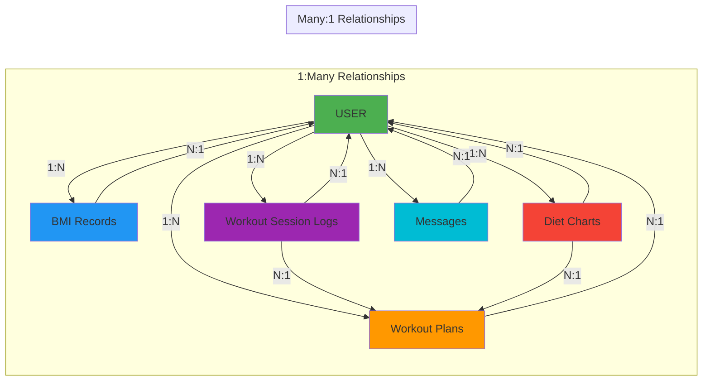
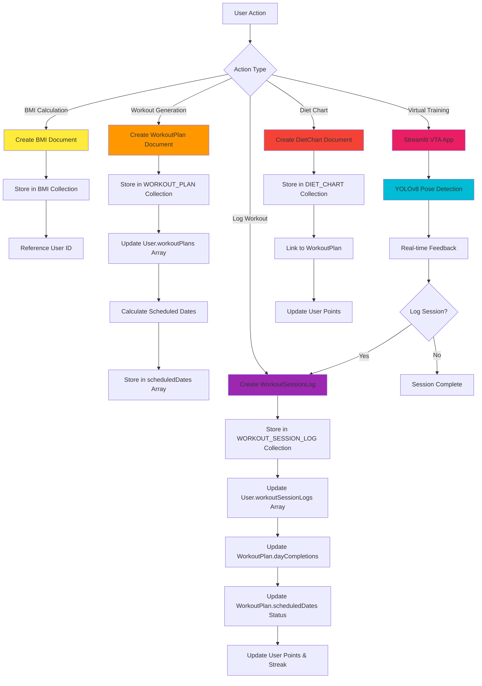

# FitSync Database Schema & Relational Diagram

## Entity Relationship Diagram (ERD)



## Detailed Schema Structure

### USER Collection

```javascript
{
  _id: ObjectId,
  firstName: String (required),
  lastName: String,
  email: String (required, unique),
  password: String (optional),
  username: String (optional),
  role: String (optional),
  
  // References
  workoutPlans: [ObjectId -> WorkoutPlan],
  workoutSessionLogs: [ObjectId -> WorkoutSessionLog],
  
  // Health Info
  diseases: [String],
  allergies: [String],
  
  // Sports Preferences
  sportsPreferences: {
    preferredSports: [String],
    sportLevel: String (enum: ["beginner", "intermediate", "advanced"]),
    sportGoals: [String]
  },
  
  // Gamification
  points: Number (default: 0),
  weeklyPoints: Number (default: 0),
  weeklyStartAt: Date,
  streakCount: Number (default: 0),
  lastActivityAt: Date,
  badges: [String],
  
  // Weekly Challenge
  weeklyChallenge: {
    title: String,
    target: Number,
    progress: Number,
    completed: Boolean,
    weekStartAt: Date
  },
  
  timestamps: true
}
```

### BMI Collection

```javascript
{
  _id: ObjectId,
  userId: ObjectId (ref: "User", required),
  heightFeet: Number (required),
  heightInches: Number (required),
  weight: Number (required),
  age: Number (required),
  diseases: [String],
  allergies: [String],
  bmi: Number (required),
  category: String (required),
  selectedPlan: String (enum: ["lose_weight", "gain_weight", "build_muscles"]),
  targetWeight: Number,
  targetTimeline: String,
  aiSuggestions: String,
  date: Date (default: Date.now)
}
```

### WORKOUT_PLAN Collection

```javascript
{
  _id: ObjectId,
  userId: ObjectId (ref: "User", required),
  name: String (required),
  description: String,
  isActive: Boolean (default: false),
  startDate: Date (default: Date.now),
  endDate: Date,
  durationWeeks: Number (default: 4),
  currentWeek: Number (default: 1),
  completed: Boolean (default: false),
  closedAt: Date,
  
  // Workout Content Structure
  planContent: [{
    day: String,
    focus: String,
    exercises: [{
      name: String,
      sets: Number,
      reps: String,
      weight: String,
      rest: String,
      notes: String,
      demonstrationLink: String
    }],
    warmup: String,
    cooldown: String
  }],
  
  // Scheduled Dates
  scheduledDates: [{
    date: Date,
    dayIndex: Number,
    weekNumber: Number,
    status: String (enum: ["pending", "completed", "missed"]),
    completedAt: Date
  }],
  
  // Progress Tracking
  completedDayCount: Number (default: 0),
  dayCompletions: [{
    weekNumber: Number,
    dayIndex: Number,
    sessionId: ObjectId (ref: "WorkoutSessionLog"),
    date: Date
  }],
  
  // Generation Parameters
  generatedParams: {
    timeCommitment: String,
    workoutType: String,
    intensity: String,
    equipment: String,
    daysPerWeek: Number,
    fitnessGoal: String,
    gender: String,
    strengthLevel: String,
    trainingMethod: String,
    currentWeight: Number,
    targetWeight: Number,
    bmiData: Object
  },
  
  // Weekly Overrides
  weeklyContentOverrides: Map,
  
  timestamps: true
}
```

### WORKOUT_SESSION_LOG Collection

```javascript
{
  _id: ObjectId,
  userId: ObjectId (ref: "User", required),
  workoutPlanId: ObjectId (ref: "WorkoutPlan", required),
  date: Date (default: Date.now),
  dayIndex: Number,
  weekNumber: Number,
  allExercisesCompleted: Boolean (default: false),
  
  workoutDetails: [{
    exerciseName: String,
    sets: Number,
    reps: String,
    weight: String,
    notes: String,
    completed: Boolean (default: false)
  }],
  
  overallNotes: String,
  perceivedExertion: Number (min: 1, max: 10),
  durationMinutes: Number,
  
  timestamps: true
}
```

### DIET_CHART Collection

```javascript
{
  _id: ObjectId,
  userId: ObjectId (ref: "User", required),
  workoutPlanId: ObjectId (ref: "WorkoutPlan", required),
  dietChart: String (required),
  durationWeeks: Number (required),
  generatedAt: Date (default: Date.now),
  isActive: Boolean (default: true)
}

// Indexes
Index: { userId: 1, workoutPlanId: 1 }
Index: { userId: 1, isActive: 1 }
```

### MESSAGE Collection

```javascript
{
  _id: ObjectId,
  user: ObjectId (ref: "User", required),
  name: String (required),
  rollNo: String (required),
  email: String,
  item: String (required),
  description: String (required),
  fakeClaim: Boolean (default: false),
  reportId: String,
  createdAt: Date (default: Date.now)
}
```

## Relationship Mappings



## Data Flow in Database Operations



## Indexes and Performance Optimization

```javascript
// User Collection Indexes
db.users.createIndex({ email: 1 }, { unique: true })
db.users.createIndex({ "weeklyChallenge.weekStartAt": 1 })

// BMI Collection Indexes
db.bmis.createIndex({ userId: 1, date: -1 }) // For fetching latest BMI
db.bmis.createIndex({ userId: 1 })

// WorkoutPlan Collection Indexes
db.workoutplans.createIndex({ userId: 1, isActive: 1 })
db.workoutplans.createIndex({ userId: 1, createdAt: -1 })
db.workoutplans.createIndex({ "scheduledDates.date": 1 })

// WorkoutSessionLog Collection Indexes
db.workoutsessionlogs.createIndex({ userId: 1, workoutPlanId: 1, date: -1 })
db.workoutsessionlogs.createIndex({ workoutPlanId: 1, date: 1 })

// DietChart Collection Indexes
db.dietcharts.createIndex({ userId: 1, workoutPlanId: 1 })
db.dietcharts.createIndex({ userId: 1, isActive: 1 })
```

## Virtual Training Assistant Integration

The Virtual Training Assistant (VTA) uses computer vision (YOLOv8) for real-time pose estimation and exercise tracking. VTA sessions can optionally be logged to the WorkoutSessionLog collection:

```javascript
// Virtual Training Session (Optional Logging)
{
  userId: ObjectId,
  workoutPlanId: ObjectId (optional, can be standalone),
  date: Date,
  dayIndex: Number (optional for VTA),
  weekNumber: Number (optional for VTA),
  allExercisesCompleted: Boolean,
  workoutDetails: [{
    exerciseName: String, // e.g., "Left Dumbbell Curl", "Lateral Raise"
    sets: Number,
    reps: String,
    weight: String (optional),
    notes: String,
    completed: Boolean
  }],
  overallNotes: String,
  perceivedExertion: Number,
  durationMinutes: Number,
  sessionType: String (enum: ["workout_plan", "virtual_training"]) // New field
}
```

**VTA Features:**
- Real-time pose detection using YOLOv8n-pose model
- Exercise form analysis and feedback
- Automatic rep counting
- Calorie estimation based on exercise type and duration
- Supports: Dumbbell Curls, Lateral Raises, Front Raises, Triceps Kickbacks
- Manual tracking mode (fallback when camera unavailable)

## Key Constraints and Validations

1. **User Email**: Unique constraint enforced at database level
2. **Workout Plan**: Only one active plan per user at a time
3. **Scheduled Dates**: Status enum validation (pending, completed, missed)
4. **Streak Logic**: Calculated based on consecutive days with activity
5. **Weekly Points**: Reset every Monday based on weeklyStartAt
6. **Workout Logging**: Validates that logged date matches scheduled date
7. **Diet Chart**: One active chart per workout plan
8. **Virtual Training**: Optional logging; can be standalone or linked to workout plan

