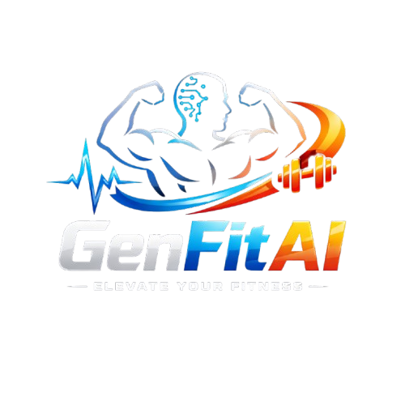

<div align="center">
  
  <br/>
  <a href="https://github.com/DrizzleAhuja/MindFit-AI">
    
  </a>
  <br/>
  
  
  
  
  
</div>

<br/>

# ✨ GenFit AI: Personalized Fitness & Wellness Platform
## 📌 Abstract

**GenFit AI** is an intelligent, holistic fitness and wellness platform designed to provide highly personalized health and fitness solutions. Leveraging Artificial Intelligence (AI), Machine Learning (ML), and Computer Vision (CV), the platform delivers comprehensive fitness management. Unlike traditional fitness apps with generic solutions, GenFit AI adapts to individual health profiles, medical conditions, and dietary restrictions to promote a sustainable, healthier lifestyle.

## 🚀 Key Features

### 🏋️ AI-Powered Workout Plan Generation
*   Generates highly customized workout routines using Google Gemini AI.
*   Considers constraints like fitness goals, strength levels, medical conditions, and time commitment.
*   Provides dynamic and progressive weekly plans.

### 🥗 Intelligent Diet Chart Generation
*   Creates personalized dietary recommendations aligned with fitness goals and BMI.
*   Factoring in individual allergies, diseases, and food preferences.
*   Offers complete macronutrient breakdowns for daily meals.

### 📸 Image-Based Calorie Tracking
*   Automated food recognition through deep learning (ResNet50 model).
*   Users can upload images of their food, and the AI will estimate portion sizes and calculate calories and nutritional value instantly.

### 🤖 Virtual Training Assistant & AI Coach
*   Real-time exercise posture tracking and form correction using TensorFlow (Pose detection) and WebRTC.
*   Voice feedback functionality (English & Hindi) for hands-free coaching.
*   A responsive FitBot/Agentic Chatbot for answering fitness queries contexts based on user profiles.

### 🎮 Gamification & Community
*   Engaging reward system features **points, daily streaks, and milestone badges**.
*   **Leaderboards** to motivate users competitively.
*   **Community connections**, social feeds, and support groups.

### 📊 Advanced Progress Analytics
*   Comprehensive user dashboard displaying real-time statistics.
*   BMI Calculator with customized AI health insights and tracking.
*   Visual charts for monitoring workout adherence and calorie consumption.

---

## 🛠️ Technology Stack

**Frontend (Client Layer)**
*   **Framework:** React.js 18.x with Vite
*   **Styling:** Tailwind CSS, Shadcn UI
*   **State Management:** Redux Toolkit
*   **Additional Libraries:** Framer Motion (Animations), Chart.js & Recharts (Analytics), React WebCam

**Backend (Application Layer)**
*   **Environment:** Node.js
*   **Framework:** Express.js
*   **Authentication:** JWT, bcryptjs, Google OAuth 2.0
*   **Real-time Communication:** Socket.io

**Database (Data Layer)**
*   **DBMS:** MongoDB (Atlas)
*   **ODM:** Mongoose

**AI & Machine Learning**
*   **Generative AI:** Google Gemini API (Groq SDK)
*   **Computer Vision (Food Image):** TensorFlow & pre-trained ResNet50
*   **Pose Detection:** Mediapipe & TensorFlow JS Models

---

## 🏗️ System Architecture

GenFit AI consists of a decoupled architecture with a React Frontend and an Express.js Backend. The system interacts seamlessly with MongoDB for data persistence and third-party AI APIs (Google Gemini, TensorFlow models) to fetch intelligent responses and recognition vectors.

---

## ⚙️ Installation & Local Setup

### Prerequisites
*   Node.js (v18+)
*   MongoDB Instance (Local or Atlas)
*   API Keys (Google Gemini API, Google OAuth, Cloudinary etc.)

### Steps to Run Correctly

1. **Clone the repository:**
   ```bash
   git clone <repository-url>
   cd MindFit-AI
   ```

2. **Frontend Setup:**
   ```bash
   cd frontend
   npm install
   # Create a .env file based on environment requirements
   npm run dev
   ```

3. **Backend Setup:**
   ```bash
   cd backend
   npm install
   # Create a .env file with necessary variables (MONGO_URI, JWT_SECRET, GROQ_API_KEY, etc.)
   npm start
   # Or for development: npm run dev
   ```

*(Alternatively, you can run `npm run dev` from the `frontend` directory if a concurrent script is configured)*

---

## 🌟 Gamification Flow Example
*   **Log a Workout Session:** +10 Points
*   **Log Food Calories:** +5 Points
*   **Maintain a 7-Day Streak:** "Consistency" Badge + Bonus Points
*   **Check Leaderboard:** Climb the ranks every week and complete the Weekly Challenges.

---

## 📝 License
This project is created for educational and development purposes by its respectful authors.
