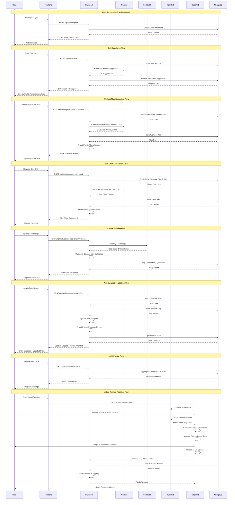
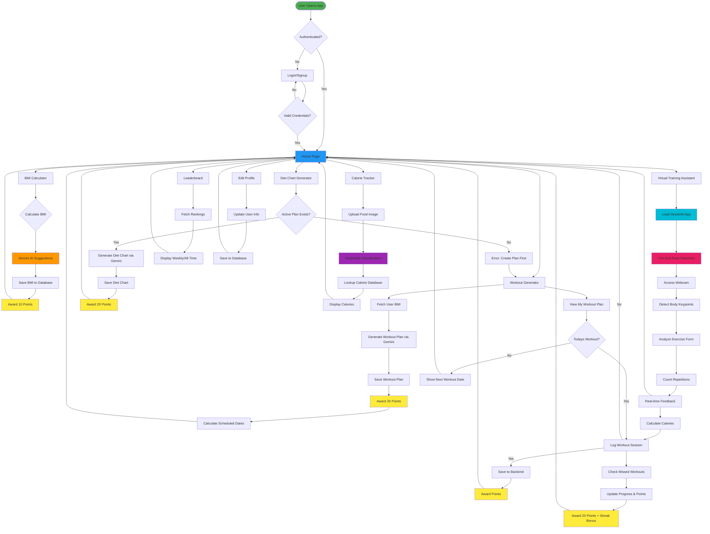

# FitSync System Architecture & Flow Diagram

## System Architecture Diagram

```mermaid
graph TB
    subgraph "Client Layer (Frontend)"
        A[React.js Application]
        A1[Home Page]
        A2[BMI Calculator]
        A3[Workout Generator]
        A4[Diet Chart Generator]
        A5[Calorie Tracker]
        A6[Leaderboard]
        A7[Profile Management]
        A8[Virtual Training Assistant]
        
        A --> A1
        A --> A2
        A --> A3
        A --> A4
        A --> A5
        A --> A6
        A --> A7
        A --> A8
    end
    
    subgraph "Application Layer (Backend)"
        B[Express.js Server]
        B1[Authentication Routes]
        B2[BMI Routes]
        B3[Workout Routes]
        B4[Diet Chart Routes]
        B5[Gamification Routes]
        B6[User Routes]
        
        B --> B1
        B --> B2
        B --> B3
        B --> B4
        B --> B5
        B --> B6
    end
    
    subgraph "AI Layer"
        C[Google Gemini API]
        C1[Workout Plan Generation]
        C2[Diet Chart Generation]
        C3[BMI Suggestions]
        C4[AI Coach Responses]
        
        C --> C1
        C --> C2
        C --> C3
        C --> C4
    end
    
    subgraph "ML Layer"
        D[ResNet50 Model]
        D1[Food Image Recognition]
        D2[Calorie Estimation]
        
        D --> D1
        D --> D2
    end
    
    subgraph "Computer Vision Layer"
        F[YOLOv8 Pose Estimation]
        F1[Real-time Pose Detection]
        F2[Exercise Form Analysis]
        F3[Rep Counting]
        F4[Form Feedback]
        
        F --> F1
        F --> F2
        F --> F3
        F --> F4
    end
    
    subgraph "Virtual Training Service"
        G[Streamlit Server]
        G1[Camera Interface]
        G2[Exercise Selection]
        G3[Real-time Processing]
        G4[Manual Tracking Mode]
        
        G --> G1
        G --> G2
        G --> G3
        G --> G4
    end
    
    subgraph "Data Layer (Database)"
        E[(MongoDB)]
        E1[User Collection]
        E2[BMI Collection]
        E3[WorkoutPlan Collection]
        E4[WorkoutSessionLog Collection]
        E5[DietChart Collection]
        E6[Message Collection]
        
        E --> E1
        E --> E2
        E --> E3
        E --> E4
        E --> E5
        E --> E6
    end
    
    A -->|HTTP/REST API| B
    A -->|iframe/Embed| G
    B -->|API Calls| C
    B -->|Image Upload| D
    B -->|CRUD Operations| E
    G -->|Video Stream| F
    F -->|Pose Data| G
    G -->|Session Data| B
    
    style A fill:#61dafb
    style B fill:#339933
    style C fill:#4285f4
    style D fill:#ff6b6b
    style E fill:#13aa52
    style F fill:#e91e63
    style G fill:#00bcd4
```

## Application Flow Diagram

```mermaid
sequenceDiagram
    participant User
    participant Frontend
    participant Backend
    participant Gemini
    participant ResNet50
    participant YOLOv8
    participant Streamlit
    participant MongoDB
    
    Note over User,MongoDB: User Registration & Authentication
    User->>Frontend: Sign Up / Login
    Frontend->>Backend: POST /api/auth/signup
    Backend->>MongoDB: Create User Document
    MongoDB-->>Backend: User Created
    Backend-->>Frontend: JWT Token + User Data
    Frontend-->>User: Authenticated
    
    Note over User,MongoDB: BMI Calculation Flow
    User->>Frontend: Enter BMI Data
    Frontend->>Backend: POST /api/bmi/save
    Backend->>MongoDB: Save BMI Record
    Backend->>Gemini: Generate Health Suggestions
    Gemini-->>Backend: AI Suggestions
    Backend->>MongoDB: Update BMI with Suggestions
    MongoDB-->>Backend: Updated BMI
    Backend-->>Frontend: BMI Result + Suggestions
    Frontend-->>User: Display BMI & Recommendations
    
    Note over User,MongoDB: Workout Plan Generation Flow
    User->>Frontend: Request Workout Plan
    Frontend->>Backend: POST /api/auth/generate-workout-plan
    Backend->>MongoDB: Fetch User BMI & Preferences
    MongoDB-->>Backend: User Data
    Backend->>Gemini: Generate Personalized Workout Plan
    Gemini-->>Backend: Structured Workout Plan
    Backend->>MongoDB: Save Workout Plan
    MongoDB-->>Backend: Plan Saved
    Backend->>Backend: Award Points (Gamification)
    Backend-->>Frontend: Workout Plan Created
    Frontend-->>User: Display Workout Plan
    
    Note over User,MongoDB: Diet Chart Generation Flow
    User->>Frontend: Request Diet Chart
    Frontend->>Backend: POST /api/auth/generate-diet-chart
    Backend->>MongoDB: Fetch Active Workout Plan & BMI
    MongoDB-->>Backend: Plan & BMI Data
    Backend->>Gemini: Generate Personalized Diet Chart
    Gemini-->>Backend: Diet Chart Content
    Backend->>MongoDB: Save Diet Chart
    MongoDB-->>Backend: Chart Saved
    Backend->>Backend: Award Points (Gamification)
    Backend-->>Frontend: Diet Chart Generated
    Frontend-->>User: Display Diet Chart
    
    Note over User,MongoDB: Calorie Tracking Flow
    User->>Frontend: Upload Food Image
    Frontend->>Backend: POST /api/auth/calorie-tracker (with image)
    Backend->>ResNet50: Classify Food Image
    ResNet50-->>Backend: Food Class & Confidence
    Backend->>Backend: Calculate Calories from Database
    Backend->>MongoDB: Log Calorie Entry (optional)
    MongoDB-->>Backend: Entry Saved
    Backend-->>Frontend: Food Name & Calories
    Frontend-->>User: Display Calorie Info
    
    Note over User,MongoDB: Workout Session Logging Flow
    User->>Frontend: Log Workout Session
    Frontend->>Backend: POST /api/auth/workout-session/log
    Backend->>MongoDB: Fetch Workout Plan
    MongoDB-->>Backend: Plan Data
    Backend->>MongoDB: Save Session Log
    MongoDB-->>Backend: Log Saved
    Backend->>Backend: Update Plan Progress
    Backend->>Backend: Award Points & Update Streak
    Backend->>MongoDB: Update User Stats
    MongoDB-->>Backend: Stats Updated
    Backend-->>Frontend: Session Logged + Points Awarded
    Frontend-->>User: Show Success + Updated Stats
    
    Note over User,MongoDB: Leaderboard Flow
    User->>Frontend: View Leaderboard
    Frontend->>Backend: GET /api/gamify/leaderboard
    Backend->>MongoDB: Aggregate User Points & Stats
    MongoDB-->>Backend: Leaderboard Data
    Backend-->>Frontend: Sorted Leaderboard
    Frontend-->>User: Display Rankings
    
    Note over User,MongoDB: Virtual Training Assistant Flow
    User->>Frontend: Open Virtual Training
    Frontend->>Streamlit: Load iframe (localhost:8501)
    Streamlit->>YOLOv8: Initialize Pose Model
    User->>Streamlit: Select Exercise & Start Camera
    Streamlit->>YOLOv8: Capture Video Frame
    YOLOv8->>Streamlit: Detect Pose Keypoints
    Streamlit->>Streamlit: Calculate Angles & Distances
    Streamlit->>Streamlit: Analyze Form & Count Reps
    Streamlit->>User: Display Real-time Feedback
    Streamlit->>Streamlit: Track Reps & Calories
    Streamlit->>Backend: Optional: Log Session Data
    Backend->>MongoDB: Save Training Session
    MongoDB-->>Backend: Session Saved
    Backend->>Backend: Award Points (if logged)
    Backend-->>Streamlit: Points Awarded
    Streamlit-->>User: Show Progress & Stats
```

## Component Interaction Flow

```mermaid
flowchart TD
    Start([User Opens App]) --> Auth{Authenticated?}
    Auth -->|No| Login[Login/Signup]
    Auth -->|Yes| Home[Home Page]
    
    Login --> AuthCheck{Valid Credentials?}
    AuthCheck -->|Yes| Home
    AuthCheck -->|No| Login
    
    Home --> BMI[BMI Calculator]
    Home --> Workout[Workout Generator]
    Home --> Diet[Diet Chart Generator]
    Home --> Calorie[Calorie Tracker]
    Home --> Virtual[Virtual Training Assistant]
    Home --> Leaderboard[Leaderboard]
    Home --> Profile[Edit Profile]
    
    BMI --> BMICalc{Calculate BMI}
    BMICalc --> GeminiAI[Gemini AI Suggestions]
    GeminiAI --> SaveBMI[Save BMI to Database]
    SaveBMI --> Points1[Award 10 Points]
    Points1 --> Home
    
    Workout --> FetchBMI[Fetch User BMI]
    FetchBMI --> WorkoutGen[Generate Workout Plan via Gemini]
    WorkoutGen --> SavePlan[Save Workout Plan]
    SavePlan --> Points2[Award 20 Points]
    Points2 --> ScheduleDates[Calculate Scheduled Dates]
    ScheduleDates --> Home
    
    Diet --> CheckPlan{Active Plan Exists?}
    CheckPlan -->|No| Error1[Error: Create Plan First]
    Error1 --> Workout
    CheckPlan -->|Yes| DietGen[Generate Diet Chart via Gemini]
    DietGen --> SaveDiet[Save Diet Chart]
    SaveDiet --> Points3[Award 20 Points]
    Points3 --> Home
    
    Calorie --> UploadImg[Upload Food Image]
    UploadImg --> ResNet[ResNet50 Classification]
    ResNet --> CalorieDB[Lookup Calorie Database]
    CalorieDB --> DisplayCal[Display Calories]
    DisplayCal --> Home
    
    Virtual --> Streamlit[Load Streamlit App]
    Streamlit --> YOLO[YOLOv8 Pose Detection]
    YOLO --> Camera[Access Webcam]
    Camera --> PoseDetect[Detect Body Keypoints]
    PoseDetect --> FormAnalysis[Analyze Exercise Form]
    FormAnalysis --> RepCount[Count Repetitions]
    RepCount --> Feedback[Real-time Feedback]
    Feedback --> CalorieBurn[Calculate Calories]
    CalorieBurn --> LogSession{Log Session?}
    LogSession -->|Yes| SaveToBackend[Save to Backend]
    SaveToBackend --> Points5[Award Points]
    Points5 --> Home
    LogSession -->|No| Home
    Feedback --> Home
    
    Workout --> ViewPlan[View My Workout Plan]
    ViewPlan --> TodayWorkout{Todays Workout?}
    TodayWorkout -->|Yes| LogSession[Log Workout Session]
    TodayWorkout -->|No| NextDate[Show Next Workout Date]
    LogSession --> CheckMissed[Check Missed Workouts]
    CheckMissed --> UpdateStats[Update Progress & Points]
    UpdateStats --> Points4[Award 20 Points + Streak Bonus]
    Points4 --> Home
    NextDate --> Home
    
    Leaderboard --> FetchLeaderboard[Fetch Rankings]
    FetchLeaderboard --> DisplayRank[Display Weekly/All-Time]
    DisplayRank --> Home
    
    Profile --> UpdateProfile[Update User Info]
    UpdateProfile --> SaveProfile[Save to Database]
    SaveProfile --> Home
    
    style Start fill:#4CAF50
    style Home fill:#2196F3
    style GeminiAI fill:#FF9800
    style ResNet fill:#9C27B0
    style YOLO fill:#E91E63
    style Streamlit fill:#00BCD4
    style Points1 fill:#FFEB3B
    style Points2 fill:#FFEB3B
    style Points3 fill:#FFEB3B
    style Points4 fill:#FFEB3B
    style Points5 fill:#FFEB3B
```

